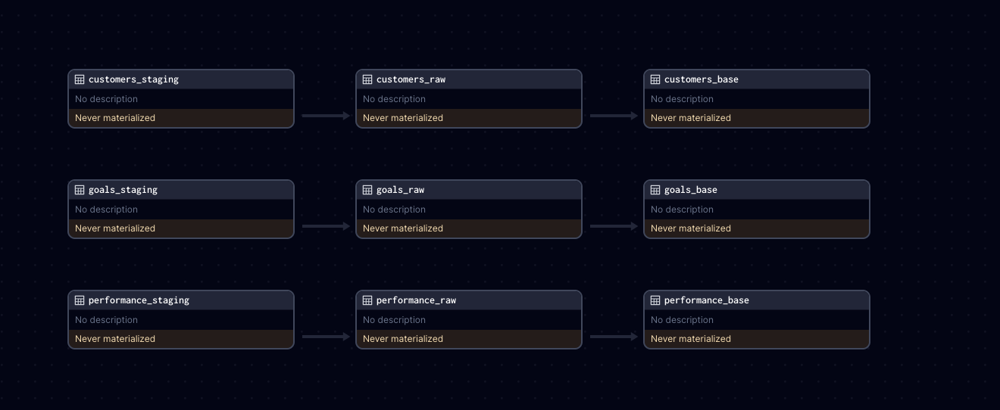

# Data Engineer Assignment

## Candidate Instructions
- The goal of this section is to develop and deploy a solution for processing data from a source database at regular intervals (eg: daily).
    - The source database is usually Postgres, MySQL etc. and destinations are usually data warehouses (dwh) like RedShift, Databricks etc.
    - But for simplicity we will use an in-memory database called [DuckDB](https://github.com/duckdb/duckdb) for this exercise as both the source and destination.
- [Dagster](https://github.com/dagster-io/dagster) is the orchestration tool being utilized to facilitate this task.
- This entails implementing a typical ELT (extract, load, transform) process involving three tables: `users`, `goals`, and `performance`. 
- The stages/layers where we expect to see the [data materialised](https://dagster.io/glossary/data-materialization) are:
    - source database table -> staging -> raw -> base
    - to learn more about why these stages exist, you can read about a similar alternative called [Medallion Architecture](https://www.databricks.com/glossary/medallion-architecture).


As part of this exercise, there are 3 steps to be accomplished for each table:
1. Extract data from the source database ([./db/source.db](./db/source.db)) to a staging area in CSV format (dump a file to your disk).
2. Transfer data from the staging area CSV files to the data warehouse `raw` tables ([./db/dwh.db](./db/dwh.db)).
3. Move data from `raw` tables to `base` tables in the data warehouse ([./db/dwh.db](./db/dwh.db)).

The expected results shown in Dagster should be as follows:


- In the third step, you will do some simple transformation using SQL. 
- Here are the list of tasks you need to accomplish in step 3.

    - `base.customers`
        - split the `name` field into `first_name` and `last_name`
        - drop the column `email`

    - `base.goals`
        - create a new column `strategy_id`, values of the column are mapped from the column `goal_type` as per the following:

            | `goal_type` | `strategy_id` |
            |---|---|
            | `GENERAL_INVESTING`, `RETIREMENT`, `CHILD_EDUCATION`, `BUY_A_HOME`, `EMERGENCY_FUND`, `TRAVEL`, `WEDDING`, `START_BUSINESS` | `CORE` |
            | `THEME_TECH`, `THEME_CONSUMER`, `THEME_HEALTHCARE` | `THEMATIC` |
            | `INCOME` | `INCOME_SGD` |
            | `MMF` | `MMF_SGD` |
        - Prepend `region` to `portfolio_id` and replace the `portfolio_id` column with the new prepended values

    - `base.performance`
        - convert unix timestamp from `calc_date` to following date format `{month}, {day}, {year}, {hour}:{min}` and replace the column with the new values
        - create a new column named `over_9000`, which is true if the `official_nav` is greater than 9000
 
The datasets provided have column names that do not have any consistent casing, do rename the column names to `all_lower_snake_case`.

### Deliverables should be the following:
1. Complete the assets code in Dagster to ensure the Dagster UI displays the expected result.
    
2. Based on the instructions above, create the dataset in [./db/dwh.db](./db/dwh.db), with the specified tables in the database.
    - `raw.customers`
    - `raw.goals`
    - `raw.performance`
    - `base.customers`
    - `base.goals`
    - `base.performance`

### Bonus:
If you feel up to the challenge, you can additionally do the following:
 - Ensure all runs are idempotent so that results remain consistent with the same input.
 - Introduce partitions and daily schedules in the performance asset.
 - Add test cases to validate the assets.

## Preparing the environment
- Fork this repository under your own GitHub username (make sure its private so your solution is not available for others to 👀)
- You can use [GitHub's own web editor](https://docs.github.com/en/codespaces/the-githubdev-web-based-editor#opening-the-githubdev-editor) by simply pressing `.` on your forked repo in the browser.
- Install your Dagster code location as a Python package. 
- By using the --editable flag, pip will install your Python package in ["editable mode"](https://pip.pypa.io/en/latest/topics/local-project-installs/#editable-installs) so that as you develop, local code changes will automatically apply.

```bash
pip install -e ".[dev]"
```

Then, start the Dagster UI web server:

```bash
dagster dev
```

Open http://localhost:3000 with your browser to see the project.

You can start writing assets in `data_engineer_assignment/assets.py`. The assets are automatically loaded into the Dagster code location as you define them.

DuckDB (in memory database) is being used to store data for the source as well as the data warehouse (dwh). There should be two files in `db` folder.
 - `db/source.db`
 - `db/dwh.db`

If you want to interact with the db, run the following commands in the terminal.
```shell
# for connecting to source db
duckcli db/source.db

# for connecting to dwh db
duckcli db/dwh.db
```
note: DuckDB only supports 1 concurrent connection, so you must `exit` if you want to run the dagster pipelines


After connecting to the db, you can run any sql queries or duckdb commands to interact with the db. Here are some examples
```shell
# view customers table
select * from customers;

# show all available tables
.tables

# help menu
.help
```

## Development

### Useful documentation
- [Defining basic Dagster asset dependencies](https://docs.dagster.io/concepts/assets/software-defined-assets#defining-basic-dependencies)
- [Configuring a Dagster asset](https://docs.dagster.io/concepts/assets/software-defined-assets#asset-configuration)
- [Partitioning Dagster assets](https://docs.dagster.io/concepts/partitions-schedules-sensors/partitioning-assets#partitioning-assets)

### Adding new Python dependencies

You can specify new Python dependencies in `setup.py`.

### Unit testing

Tests are in the `data_engineer_assignment_tests` directory and you can run tests using `pytest`:

```bash
pytest data_engineer_assignment_tests
```

### Schedules and sensors

If you want to enable Dagster [Schedules](https://docs.dagster.io/concepts/partitions-schedules-sensors/schedules) or [Sensors](https://docs.dagster.io/concepts/partitions-schedules-sensors/sensors) for your jobs, the [Dagster Daemon](https://docs.dagster.io/deployment/dagster-daemon) process must be running. This is done automatically when you run `dagster dev`.

Once your Dagster Daemon is running, you can start turning on schedules and sensors for your jobs.
